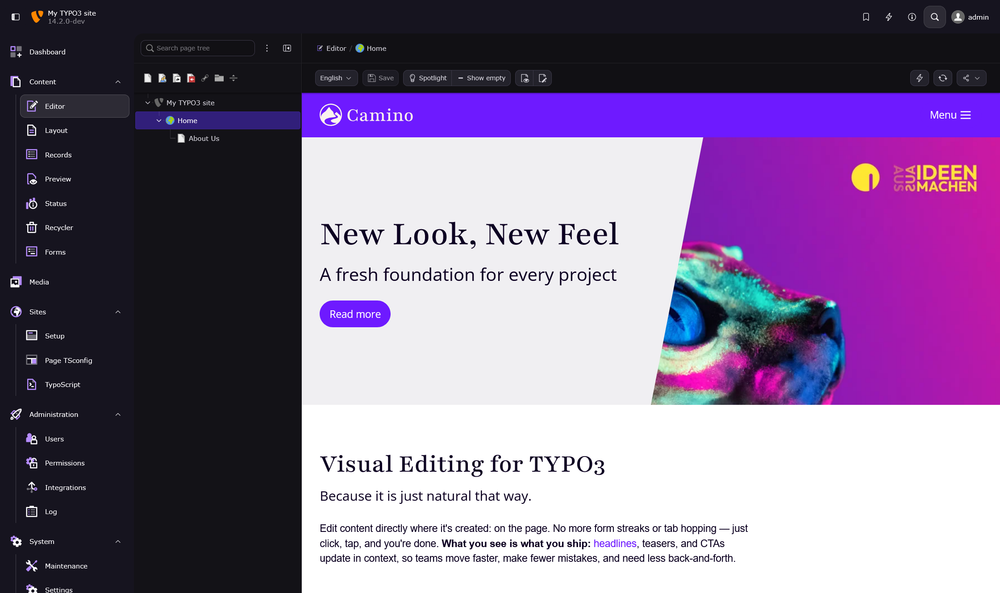

# Demo Setup EXT:visual_editor

[What is the Visual Editor?](https://github.com/andersundsehr/visual_editor)

This demo now also includes:

- `supseven/inline-page-module` for TYPO3 14 inline `news` content elements
- `dirnbauer/visual-editor-news-addon`, which connects `news`, `inline_page_module`, and `visual_editor`

## Prerequisites

- [ddev](https://ddev.com/)

## How to setup the demo:

1. Clone the repository
2. Run `ddev start`
3. Run `ddev composer install`
4. Run `ddev import-db --file=dump.sql.gz`
5. Run `ddev launch /typo3/module/web/edit` user: `admin` password: `Demo123*`
6. If you want to update the `EXT:visual_editor` run this: `ddev composer u friendsoftypo3/visual-editor`

You should see this:

# with ♥️ from 

> If something did not work 😮
> or you appreciate this Extension 🥰 let us know.

> We are always looking for great people to join our team!
> https://www.andersundsehr.com/karriere/
